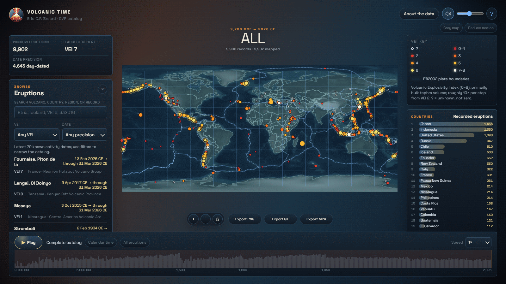

# Volcanic Time

Watch about 9,900 recorded Holocene volcanic eruptions appear on a world map, from 9,700 BCE to 2026 CE, and hear them as drums and piano.

**[Open the live app](https://ebreard.github.io/volcanic-time/)**



Built by Eric C.P. Breard, University of Edinburgh, School of GeoSciences.

## What it does

- Plays the whole Smithsonian Global Volcanism Program (GVP) Holocene eruption catalogue through time: 9,906 eruption records. The 9,902 that can be placed on the map come from 848 volcanoes. Twelve records in the GVP export are dated before 9,700 BCE, the start of the Holocene, and are left out.
- Colours each eruption by its Volcanic Explosivity Index (VEI) and marks how precisely its start date is known.
- Turns each record into sound: a drum or cymbal hit chosen by VEI, plus a quiet piano note when the VEI is known. Longitude sets left and right balance.
- Lets you search by volcano, country, region or record number, and filter by VEI and date precision.
- Exports the view as a 1920 x 1080 PNG, GIF or MP4 with a VEI key (MP4 includes the sound).

## How to use it

| Control | What it does |
|---|---|
| Play / Replay | Runs the timeline. The default Calendar time mode lasts about three minutes at 1x, with dense periods slowed down. |
| Speed | 0.5x, 1x or 2x. It changes spacing between sounds, not pitch. |
| Calendar time / Event rhythm | Toggle between calendar timing and event-rhythm timing. |
| All eruptions | Jump to the complete catalogue, one symbol per volcano. |
| Sound button and slider | Mute or set the volume. |
| Browse Eruptions | Search box plus VEI and Date filters. Click a record to see it and open its GVP page. |
| Map buttons | Zoom in, zoom out, reset the view. |
| Export PNG / GIF / MP4 | Save the current view. MP4 records the full catalogue at 1x calendar speed and takes about three minutes. Keep the tab visible until it finishes. |
| Grey map | Turns the relief and map lines grey, so only the eruptions carry colour. |
| Reduce motion | Stops eruption rings from expanding. |
| About the data | Full explanation of the data, the VEI scale and every sound mapping. |

## Reading the data

- This is a record of observations, not of every eruption. Older records are much less complete, and many dates are known only to the year.
- VEI runs from 0 to 8 and is mainly based on bulk tephra volume. A question mark means the VEI is unknown, not zero.
- Dates known only to the year are placed at midyear. A repeated sound pattern is not evidence of a volcanic cycle.
- The sounds are musical choices to represent data, not recordings of eruptions.

## Run it yourself

The app is plain static files with no build step. It must be served over HTTP, because it loads data and audio with `fetch`. Opening `index.html` by double-click will not work.

```
git clone https://github.com/ebreard/volcanic-time.git
cd volcanic-time
python -m http.server 8000
```

Then open http://localhost:8000. To host it, serve the repository root with any static host, for example GitHub Pages.

The tectonic plate lines load from raw.githubusercontent.com at run time. Offline, everything else still works without them.

## Browser support

- Tested: current Chromium (desktop). Load, playback with sound, search and filters, PNG export and GIF export all ran with no errors.
- MP4 export uses the browser's MP4 recorder. The app asks for a current Chrome, Edge or Safari.
- Firefox is untested and its MP4 export support is not confirmed.

## Data and licences

- **Code:** MIT (see `LICENSE`). This covers the application code only.
- **Eruption data (`data.js`):** Smithsonian Institution, Global Volcanism Program, Volcanoes of the World. It is used under the Smithsonian terms of use (https://volcano.si.edu/gvp_termsofuse.cfm): cite the source, keep credits, and no commercial use. It is not covered by the MIT licence. This project is independent and is not endorsed by the Smithsonian.
- **Drum samples:** Salamander Drumkit, adapted, CC BY-SA 3.0. Piano samples: VSCO 2 Community Edition, CC0.
- **Logo (`assets/ecpb_roundel.png`):** all rights reserved.
- Full list, versions and links: `THIRD_PARTY_NOTICES.md`.

## Cite

Global Volcanism Program, 2026. [Database] Volcanoes of the World (v. 5.4.0; 7 Aug 2026). Distributed by Smithsonian Institution, compiled by Venzke, E. https://doi.org/10.5479/si.GVP.VOTW5-2026.5.4

Breard, E.C.P., 2026. Volcanic Time: an audiovisual browser for the GVP Holocene eruption catalogue. University of Edinburgh. https://github.com/ebreard/volcanic-time
